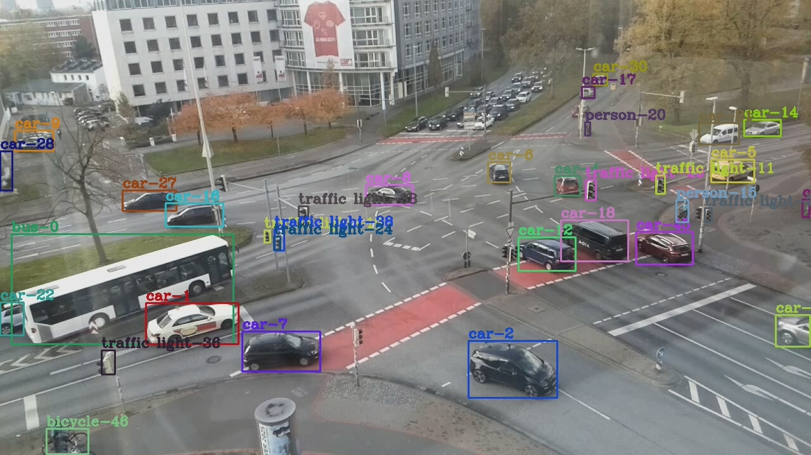
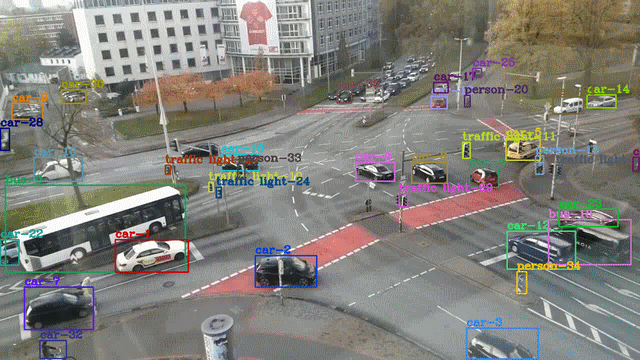

<!--
 * @Author: xuarehere
 * @Date: 2022-09-18 04:14:53
 * @LastEditTime: 2022-10-24 13:55:58
 * @LastEditors: xujianrong
 * @Description: 
 * @FilePath: /yolov7_deepsort_tensorrt/README.md
 * 可以输入预定的版权声明、个性签名、空行等
-->
- [**Object Tracking with TensorRT**](#object-tracking-with-tensorrt)
  - [**Introduction**](#introduction)
  - [**Model**](#model)
  - [**Project structure**](#project-structure)
  - [**Dependencies**](#dependencies)
  - [**Quick Start**](#quick-start)
  - [**Demo videos and images**](#demo-videos-and-images)
  - [**Reference**](#reference)
#  **Object Tracking with TensorRT**

## **Introduction**


  This is an implementation of MOT tracking algorithm deep sort cplusplus code.  Deep sort is basicly the same with sort but added a CNN model to extract features in image of human part bounded by a detector. This CNN model is indeed a RE-ID model. The idea of [deepsort](https://arxiv.org/abs/1703.07402) is adopted in object tracking. 

  We use [yolov7](https://github.com/WongKinYiu/yolov7) model as the object detector. And the feature extractor is RE-ID model as which  [fast-reid](https://github.com/JDAI-CV/fast-reid) is used. The purpose of using these lightweight models is to ensure the real-time efficiency of video processing. The model inference base on [TensorRT](https://developer.nvidia.com/zh-cn/tensorrt) engine. It also supports yolov5 as a detector.


## **Model**

**Object detection**
- YOLOV7
- YOLOV5s

**ReID** 
- fast-reid(mobilenet-v2)


## **Project structure**

<details><summary> <b>Expand</b> </summary>

```
yolov7_deepsort_tensorrt/
|-- build
|-- configs
|-- depends
|   `-- yaml-cpp
|       |-- include
|       |   `-- yaml-cpp
|       |       |-- contrib
|       |       `-- node
|       |           `-- detail
|       `-- libs
|-- includes
|-- samples
|-- scripts
|-- src
`-- weights
```

</details>

## **Dependencies**
<details><summary> <b>Expand</b> </summary>

```
OpenCV >= 4.1.1
CUDA Version: 11.1
CUDNN Version: 8.1.0
Tensorrt: 7.2.2
Yaml: 0.7.0
```
</details>


## **Quick Start**

<details><summary> <b>Expand</b> </summary>

**0. Check all dependencies installed**

see [`Dependencies`](#Dependencies) for more detail.

**1. Clone this repository and models**

**1.1 Get this repository**
```
git clone https://github.com/xuarehere/yolov7_deepsort_tensorrt.git
```

**1.2 Get the models**

```
cd scripts/
bash scripts/get_weight.sh
```

In addition, you could get the model from the [releases](https://github.com/xuarehere/yolov7_deepsort_tensorrt/releases/tag/v0.0.1). Then, the step2 and the step3 could be skipped Optionally.

**2. Get detector parameters(Optionally)**

```
cd weights
# Get model parameters
cd ../
```

**yolov7**

Please use the unofficial project [unofficial-yolov7](https://github.com/linghu8812/yolov7) to get the ONNX model. Run the following command
```
git clone https://github.com/linghu8812/yolov7.git
cd yolov7
python export.py --weights ./weights/yolov7.pt --simplify --grid 
```


**3. Get ReID parameters(Optionally)**

```
cd weights
# Get model parameters
cd ../
```

Please use the official project [fast-reid](https://github.com/JDAI-CV/fast-reid) to get the ONNX model. Run the following command
```
https://github.com/JDAI-CV/fast-reid.git
python3 tools/deploy/onnx_export.py --config-file configs/Market1501/mgn_R50-ibn.yml --name mgn_R50-ibn --output outputs/onnx_model --batch-size 32 --opts MODEL.WEIGHTS market_mgn_R50-ibn.pth
```

**4. Prepare video for inference**

We provide a default video for inference(`001.avi`). You could change it with yours.

**5. Buid project**

5.1 Use `build.sh`
```
cd scripts
bash build.sh
```

If the directory `./build` exists, you want to remove it and build it again, please use the command:

```
cd scripts
bash build.sh rm
```

5.2 Build it manually

```
mkdir build 
cd scripts
cd ../build/  && cmake .. && make -j$(nproc) && cd -
```


**6. Run demo**
```
cd scripts
bash yolov7_deepsort.sh
```
</details>

## **Demo videos and images**



## **Reference**
<details><summary> <b>Expand</b> </summary>

- **yolov7:** [https://github.com/WongKinYiu/yolov7](https://github.com/WongKinYiu/yolov7)
- **yolovx:** [https://github.com/xuarehere/yolovx_deepsort_pytorch](https://github.com/xuarehere/yolovx_deepsort_pytorch)
- **yolov5:** [https://github.com/ultralytics/yolov5](https://github.com/ultralytics/yolov5)
- **yolov5_fastreid_deepsort_tensorrt:**[https://github.com/linghu8812/yolov5_fastreid_deepsort_tensorrt](https://github.com/linghu8812/yolov5_fastreid_deepsort_tensorrt)
- **FastReID: A Pytorch Toolbox for General Instance Re-identification:** [https://arxiv.org/abs/2006.02631](https://arxiv.org/abs/2006.02631)
- **fast-reid:** [https://github.com/JDAI-CV/fast-reid](https://github.com/JDAI-CV/fast-reid)
- **Simple Online and Realtime Tracking:** [https://arxiv.org/abs/1602.00763](https://arxiv.org/abs/1602.00763)
- **sort-cpp:** [https://github.com/mcximing/sort-cpp](https://github.com/mcximing/sort-cpp)
- **Simple Online and Realtime Tracking with a Deep Association Metric:** [https://arxiv.org/abs/1703.07402](https://arxiv.org/abs/1703.07402)
- **tensorrt_inference:** [https://github.com/linghu8812/tensorrt_inference](https://github.com/linghu8812/tensorrt_inference)

</details>